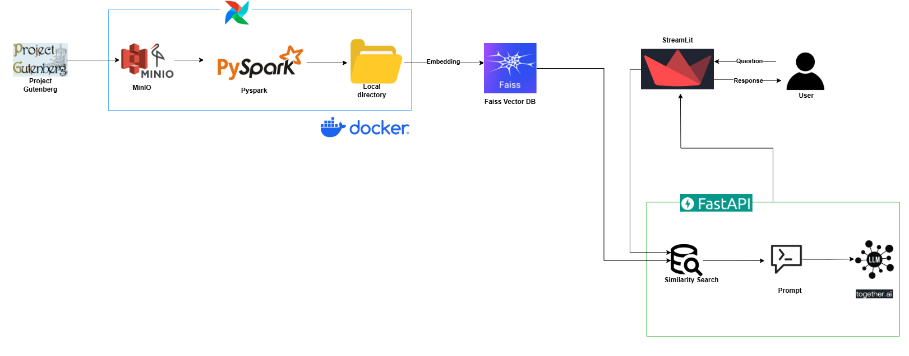

# Data Scrape to RAG
This repository contains a question-answering system that combines a FastAPI backend for processing and embedding text data with a Streamlit frontend for an interactive user interface. The system leverages FAISS for efficient similarity search and the Together AI API for generating answers based on retrieved context from text files.
## What is it?

This is a local application designed to answer questions based on a collection of text documents. It scraps data from source (Project Gutenberg),processes text files, generates embeddings, indexes them with FAISS for quick retrieval, and uses the Together AI API to provide natural language responses. The system features a user-friendly Streamlit interface and a robust FastAPI backend, making it suitable for demos or small-scale knowledge retrieval tasks.

## Table of Contents
[Features](#features)\
[Architecture Diagram](#architecture-diagram)\
[Technologies Used](#technologies-used)\
[Dependencies (Getting Started)](#dependencies-getting-started)\
[Installation](#installation)\
[Configuration](#configuration)\
[Enhancement](#enhancement)

## Features
- **Data Extraction**: Use scrapping to load data from source.
- **Data Processing**: Performed transformation on the extracted data.
- **Text Embedding**: Uses SentenceTransformers to convert text files into vector embeddings.
- **Similarity Search**: Employs FAISS to efficiently retrieve the most relevant documents based on a question.
- **AI-Powered Answers**: Integrates with the Together AI API to generate accurate and context-aware responses.
- **Interactive UI**: Provides a Streamlit-based web interface for users to input questions and view results.
- **Source Attribution**: Displays the source files of retrieved context for transparency.
- **Local Execution**: Runs entirely on local machine with no external dependencies beyond the Together AI API.

---

## Architecture Diagram
The following diagram illustrates the architecture of the framework:



### Explanation of Architecture
- **Data Source**: The process begins with raw data scraped from Project Gutenberg, using a custom scraping script.
- **Scraping Process**: Data is extracted and prepared for storage, ensuring it’s in a suitable format (e.g., text files).
- **MinIO Storage**: Scraped data is uploaded to a MinIO bucket, serving as a centralized storage solution within the Docker environment.
- **Airflow Orchestration**: Apache Airflow coordinates the data pipeline, and managing tasks such as data ingestion, processing, and transfer.
- **PySpark Processing**: PySpark processes the data from MinIO, performing transformations and loads it into the target directory.
- **Target Directory (data/silver)**: Processed text files are stored locally in the `data/silver` directory, accessible for embedding generation.
- **Docker Services**: The entire pipeline, including MinIO, Airflow, and PySpark, runs within Docker containers, ensuring portability and consistency.
- **Embeddings & FAISS Index (data)**: The FastAPI backend generates embeddings using SentenceTransformers, indexes them with FAISS, and saves them in the `data` directory alongside metadata.
- **FastAPI Backend**: Runs on port 8000, handles question processing by retrieving context from the FAISS index, and queries the Together AI API. It uses CORS to allow cross-origin requests from Streamlit.
- **Streamlit Frontend**: Runs on port 8501, serves as the user interface where questions are input via a browser, and displays answers and sources.
- **Together AI API**: An external service that generates answers based on the provided context, accessed via API key.
- **User Interface**: Users interact with the system through the Streamlit UI in their browser.
- **Flow**: Data is scraped, stored in MinIO, orchestrated by Airflow, processed by PySpark, and moved to the target directory. The FastAPI backend then embeds and indexes the data, retrieves context for user questions, queries Together AI, and returns responses to the Streamlit frontend for display.

## Technologies Used
- **Python**: The primary programming language.
- **FastAPI**: A modern, fast web framework for the backend API.
- **Streamlit**: A framework for building interactive web applications with Python.
- **FAISS**: A library for efficient similarity search and clustering of dense vectors.
- **Together AI API**: An external AI service for natural language generation.
- **Apache Airflow**: For workflow orchestration.
- **PySpark**: For distributed data processing.
- **MinIO**: For object storage.
- **Docker**: For containerizing services.

## Dependencies (Getting Started)

### Prerequisites
- **Python 3.10+**: Ensure Python is installed on your system.
- **Docker**: Required for running the data pipeline services (if using the full stack).
- **Together AI** (Create free acount and get API key. It won't cost for running opensource model : [Together AI](https://www.together.ai/))


### Installation

1. **Clone the Repository**:
   ```bash
   git clone https://github.com/Sujangyawali/Data-Scrape-to-RAG.git
   cd Data-Scrape-to-RAG
   ```
2. **Configure Environment**:
   Create a `.env` file in the project root with Together AI API key and connetion details to connect MINIO.Ycan use existing .env in repo for local run.
     ```
    MINIO_ENDPOINT=
    MINIO_ACCESS_KEY=
    MINIO_SECRET_KEY=
    MINIO_BUCKET_RAW=
    MINIO_BUCKET_GOLD=
    TOGETHER_API_KEY=
   ```
3. **Run docker container**:
   ```bash
   docker-compose up -d
   ```
   This will load data into 'Data-Scrape-to-RAG\data\silver\books'

4. **Create a Virtual Environment**:
   ```bash
   python -m venv venv
   source venv/bin/activate  # On Windows: venv\Scripts\activate
   ```

5. **Install Dependencies**:
   Install the required Python packages:
   ```bash
   pip install -r requirements-local.txt
   ```
6. **Create Vector DB and Embeddings**:   
   (Note:For quick check you can keep only few files having low size.)
   ```bash
   python embeddings.py
   ```
   

## Configuration

### Running the Application
1. **Start the FastAPI Backend**:
   - In one terminal(after activation virtual environment and instllation libraries), run the backend server:
     ```bash
     python api.py
     ```
   - This will start the API on `http://localhost:8000`.

2. **Start the Streamlit Frontend**:
   - In another terminal, run the frontend UI:
     ```bash
     streamlit run app.py
     ```
   - This will start the Streamlit app, typically accessible at `http://localhost:8501`.

3. **Access the UI**:
   - Open a browser and navigate to the Streamlit URL (e.g., `http://localhost:8501`).
   - Enter a question in the text input field and click "Submit" to see the answer and sources.

---

## Enhancement
Future updates to the framework will include:
1. Containerised entire application (as RAG par is running outside it)
2. Enhance data processing/Pipeline for multiple stages and orchestrate via airflow
3. Email and notification services for batch processes
4. Caching:Implement more advanced caching to improve performance
5. Stream output in UI
6. Add testing mechamism
7. Logging and Auditing for each activity/script